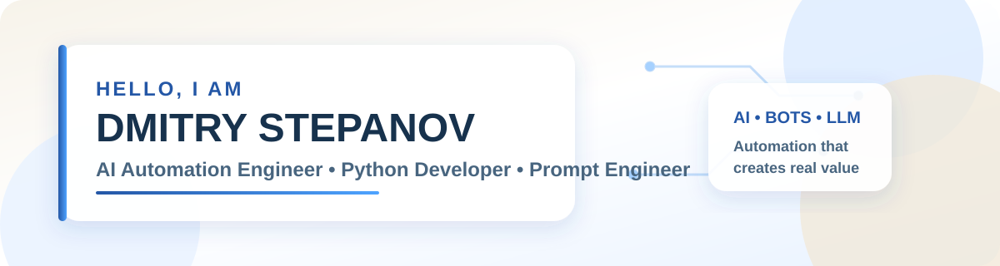

  

  
  

## 👋 About me

I am **Dmitry Stepanov**, a **Prompt Engineer**.

I design structured prompts, test LLM behavior and create practical AI solutions for real tasks. I work with Telegram bots, AI assistants, prompt chains, context management and business-process automation.

- 🧠 Designing and improving prompts for LLMs
- 🧪 Testing responses, scenarios and prompt quality
- 🤖 Creating AI assistants and Telegram bots
- 🔗 Building LLM integrations and prompt chains
- ⚙️ Automating routine tasks with AI
- 📚 Developing reusable prompt templates and practical AI cases

## 🛠 Tech stack

  
  
  
  
  
  
  
  
  

## 🚀 What I do

| Direction | What I do |
|---|---|
| **Prompt engineering** | Structured prompts, prompt chains, testing and reusable templates |
| **LLM integrations** | Context handling, external tools and API-based AI workflows |
| **AI assistants** | Telegram assistants, FAQ bots and task-oriented agents |
| **AI automation** | Automation of routine operations and information processing |
| **Prompt evaluation** | Comparison of prompt variants, response analysis and improvement |

## 📌 Featured projects

### 1. [🌿 Лендинг частного психолога](https://github.com/dimitry8st-prog/Lending-)

Кратко: профессиональный адаптивный сайт-визитка для привлечения клиентов и подготовки к рекламе и SEO.

<strong>Подробнее о проекте</strong>

Портфолио-кейс адаптивного конверсионного сайта для частных психологов, психотерапевтов и специалистов помогающих профессий. Лендинг создан как профессиональная интернет-визитка и основа для получения заявок, запуска Google Ads и дальнейшего SEO-продвижения.

**Цель проекта:** представить специалиста, сформировать доверие, объяснить формат консультации, снять основные сомнения и привести посетителя к записи без агрессивных обещаний и давления.

**Что входит в решение:**

- первый экран с понятным предложением и призывом к записи;
- блоки о специалисте, направлениях работы и процессе консультации;
- преимущества, отзывы, FAQ, контакты и форма заявки;
- последовательный пользовательский путь от знакомства до обращения;
- адаптация под компьютер, планшет и смартфон;
- семантическая структура, SEO-метаданные, sitemap и robots;
- подготовка к подключению Google Analytics 4, Google Tag Manager и рекламных целей;
- архитектура для интеграции с CRM, календарём, мессенджерами или WordPress.

Стек: **Next.js 16, React 19, TypeScript, Vinext и Cloudflare**. В демоверсии используются вымышленные данные психолога Анны Мироновой. Перед рабочим запуском требуется заменить контент, подключить обработку формы, аналитику и документы по персональным данным.

**[Открыть работающий сайт →](https://psychologist-landing.ketwolsheb.chatgpt.site)** · **[Исходный код и полное описание →](https://github.com/dimitry8st-prog/Lending-)**

### 2. [🥋 Force Team — лендинг клуба единоборств](https://github.com/dimitry8st-prog/-_-)

Кратко: адаптивный конверсионный сайт секции самбо, боевого самбо и джиу-джитсу для записи на пробную тренировку.

<strong>Подробнее о проекте</strong>

Портфолио-кейс одностраничного сайта спортивного клуба. Лендинг создан, чтобы помочь родителям детей от 4 лет и взрослым спортсменам быстро понять направления, расписание и филиалы и оставить заявку на бесплатное пробное занятие.

**Зачем создан:** спортивной секции нужен понятный цифровой вход вместо разрозненных сообщений в мессенджерах — объяснить разницу направлений, снять страх «не тот возраст / не готов», показать формат старта и собрать контакты без звонка администратору.

**Для кого:**
- родители детей от 4 лет — безопасный старт и запись ребёнка;
- подростки и взрослые — боевое самбо и джиу-джитсу;
- владелец клуба — визитка для рекламы, сарафана и локального продвижения;
- заказчик лендинга — готовый шаблон спортивной школы под замену бренда.

**Что входит в решение:**
- сильный первый экран с фирменным визуалом и CTA на запись;
- блоки о клубе, направлениях, тренерах, расписании и абонементах;
- филиалы, медиа-блок жизни клуба и форма заявки с валидацией;
- адаптив под компьютер, планшет и смартфон (fluid-типографика, мобильное меню);
- базовая SEO-подготовка и архитектура под Cloudflare Workers.

Стек: **React 19, TypeScript, Vinext / Vite, CSS, Cloudflare Workers**. В демоверсии — нейтральный бренд Force Team; перед запуском нужно подставить реальные фото, адреса, цены и обработчик формы (CRM / Telegram / email).

**[Исходный код и полное описание →](https://github.com/dimitry8st-prog/-_-)**

### 3. [✨ ÉLAN — Evidence-Based Cosmetology Clinic Landing](https://github.com/dimitry8st-prog/ELAN---)
One-page landing for the **ÉLAN** cosmetology clinic (Moscow): services, specialists, pricing, promotions, gallery, doctor blog, FAQ accordion and an online consultation booking form. Built with Next.js 16, React 19, Vite/vinext, Tailwind CSS 4 and TypeScript; ready for Cloudflare Workers / D1.

### 4. [🚘 AutoSfera AI — Multi-Agent Platform for Car Dealerships](https://github.com/dimitry8st-prog/AutoSfera-AI-)
**OpenAI Build Week 2026 participant project.**

A working multi-agent AI platform for automotive dealerships with four specialized agents for sales, customer support, service and employee assistance. Includes 16 business skills, RAG over the dealership knowledge base, FastAPI, SQLite persistence, lead and service-request management, analytics, dealer-level data isolation and an offline demonstration mode. Verified by 19 automated tests.

### [⚖️ LegalBot — Legal Document Assistant](https://github.com/dimitry8st-prog/Legal-Bot-)
Telegram bot for processing PDF court decisions, detecting possible procedural violations, finding references to Russian law and generating a DOCX draft appeal. Uses OCR, RAG, GigaChat, ChromaDB and python-docx.

### [🤖 Multimodal AI Assistant](https://github.com/dimitry8st-prog/PEM_04-multimodal_assistant)
Telegram assistant for text, PDF, image and voice processing. Includes prompt routing, Vision, speech recognition, voice synthesis and image generation.

### [⚡ QuickReply — FAQ Support Bot](https://github.com/dimitry8st-prog/PEM_06_QuickReply)
Support bot with FAQ search, negative-tone detection, GigaChat fallback and SQLite dialogue history.

### [🧠 Telegram RAG Bot](https://github.com/dimitry8st-prog/REr_09.1-RAG_BOT)
RAG assistant with FAISS vector search, document indexing, dialogue memory, source-aware answers and OpenAI/ProxyAPI implementations.

> Each project includes a task description, technology stack, functional blocks, visual preview, architecture and launch instructions.

## 📈 GitHub statistics

  
  

  

## 🎯 Current focus

- Prompt engineering for real business tasks
- Reliable prompt chains and context management
- AI assistants and Telegram bots
- Prompt testing and evaluation
- Better project documentation and packaging

## 📬 Contacts

- GitHub: [dimitry8st-prog](https://github.com/dimitry8st-prog)
- Telegram: [@Dmitryprompt](https://t.me/Dmitryprompt)
- Email: [dimitry8st@gmail.com](mailto:dimitry8st@gmail.com)
- Email: [dimitry.analytix@gmail.com](mailto:dimitry.analytix@gmail.com)

---

  <b>Turning clear ideas into reliable prompts and useful AI solutions.</b>

